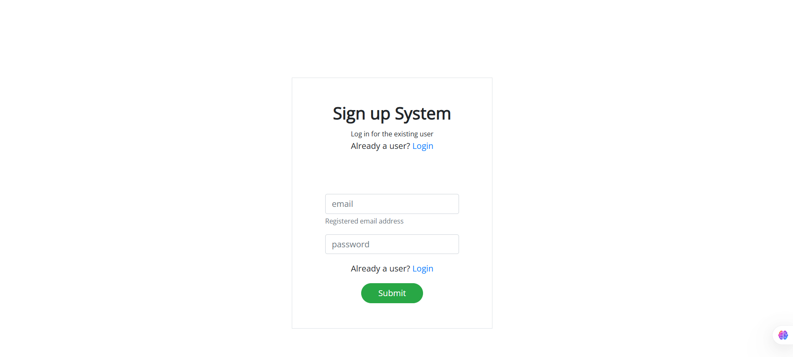

# 🌿 PeerPath

PeerPath is a Node.js-based web application built using **Express.js**.
It provides a simple backend server to handle application logic and serve content.

---

## 📸 Screenshots

### 1️⃣ Application View

<p align="center">
  
</p>

---

### 2️⃣ Server Running

<p align="center">
  
</p>

---

## 🛠️ Tech Stack

* **Backend:** Node.js, Express.js
* **Frontend:** HTML, CSS, JavaScript

---

## 📁 Project Structure

```bash
PeerPath/
│── backend/
│   └── app/
│       ├── node_modules/
│       ├── views/
│       ├── app.js / server.js
│       └── ...
│
│── frontend/
│── screenshots/
│   ├── 1.jpg
│   ├── 2.jpg
│── README.md
│── package-lock.json
```

---

## 🚀 How to Run Locally

### 1️⃣ Clone the repository

```bash
git clone https://github.com/keesha-luthra/PeerPath.git
cd PeerPath
```

---

### 2️⃣ Install dependencies

```bash
cd backend/app
npm install
```

---

### 3️⃣ Run the server

```bash
node server.js
```

---

### 4️⃣ Open in browser

```
http://localhost:3000
```

*(Port may vary depending on your setup)*

---

## ⚠️ Notes

* Make sure **Node.js** is installed
* No database setup required
* Ensure correct entry file (`app.js` or `server.js`)

---

## 👩‍💻 Author

**Keesha Luthra**
